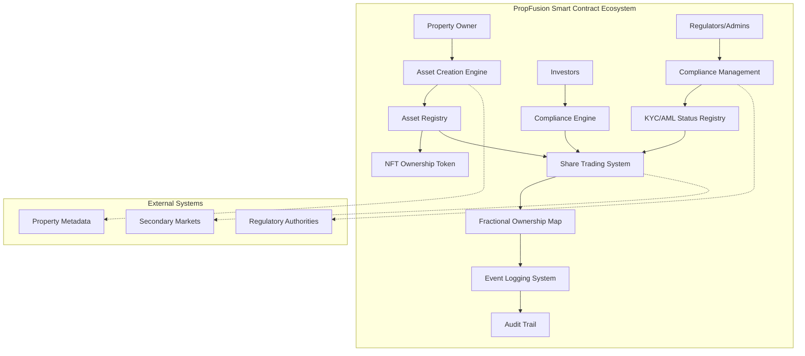
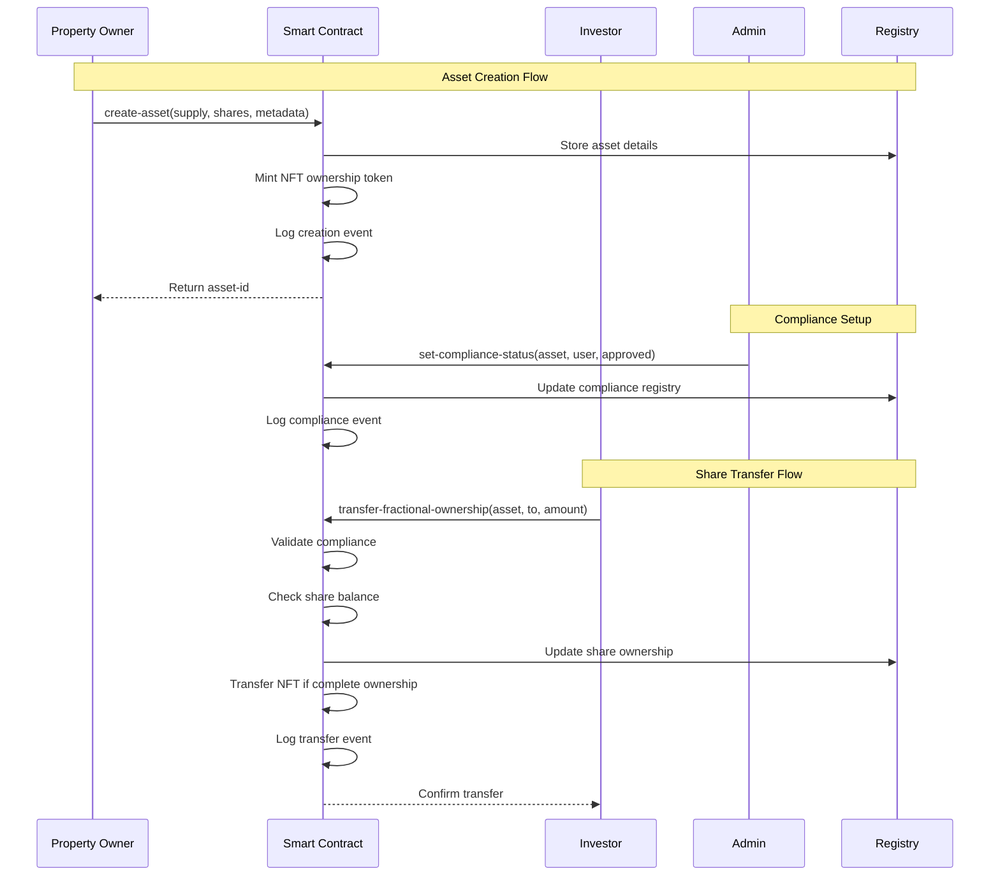

# PropFusion - Next-Generation Decentralized Property Investment Ecosystem

[](https://opensource.org/licenses/MIT)
[](https://clarity-lang.org/)
[](https://www.stacks.co/)

## 🏠 Overview

PropFusion revolutionizes global real estate markets by creating liquid, accessible, and transparent property investment opportunities through advanced blockchain tokenization and intelligent fractional ownership. Our sophisticated smart contract infrastructure enables seamless conversion of physical properties into digital investment vehicles, allowing global investors to participate in premium real estate opportunities regardless of capital size or geographic location.

## ✨ Key Features

- **🔗 Dynamic Fractional Ownership**: Transform any property into tradeable micro-shares
- **⚖️ Automated Compliance Engine**: Seamless KYC/AML integration with regulatory frameworks
- **🌍 Global Liquidity Pool**: 24/7 trading capabilities across international markets
- **📜 Immutable Ownership Records**: Blockchain-verified property rights and transaction history
- **🏛️ Smart Governance System**: Decentralized decision-making for property management
- **🌐 Cross-Chain Compatibility**: Multi-blockchain support for maximum accessibility

## 🏗️ System Architecture



## 🔧 Contract Architecture

### Core Components

#### 1. **Asset Registry System**

- **Purpose**: Comprehensive property metadata storage
- **Structure**: Maps asset IDs to property details including ownership, supply, and transferability
- **Key Fields**: `owner`, `total-supply`, `fractional-shares`, `metadata-uri`, `is-transferable`, `created-at`

#### 2. **Fractional Ownership Engine**

- **Purpose**: Precise tracking of share distribution among investors
- **Mechanism**: Maps asset-owner pairs to share quantities
- **Atomic Operations**: Ensures consistent state during transfers

#### 3. **Compliance Framework**

- **Purpose**: Advanced KYC/AML tracking and regulatory compliance
- **Features**: User approval status, last update tracking, administrative oversight
- **Integration**: Mandatory compliance checks before share transfers

#### 4. **NFT Infrastructure**

- **Token Type**: Non-Fungible Token representing primary ownership
- **Purpose**: Represents complete asset ownership certificates
- **Transfer Logic**: Automatic NFT transfer when complete ownership changes hands

#### 5. **Event Audit System**

- **Purpose**: Comprehensive transaction and state change logging
- **Coverage**: Asset creation, transfers, compliance updates
- **Immutability**: Permanent audit trail for regulatory and transparency purposes

### Data Flow Diagram



## 🚀 Getting Started

### Prerequisites

- [Clarinet CLI](https://github.com/hirosystems/clarinet) installed
- [Node.js](https://nodejs.org/) v16 or higher
- [Stacks Wallet](https://www.hiro.so/wallet) for testing

### Installation

1. **Clone the repository**

   ```bash
   git clone https://github.com/glory-benny/prop-fusion.git
   cd prop-fusion
   ```

2. **Install dependencies**

   ```bash
   npm install
   ```

3. **Run contract checks**

   ```bash
   clarinet check
   ```

4. **Run tests**

   ```bash
   npm test
   ```

### Project Structure

```
prop-fusion/
├── contracts/
│   └── prop-fusion.clar          # Main smart contract
├── tests/
│   └── prop-fusion.test.ts       # Comprehensive test suite
├── settings/
│   ├── Devnet.toml              # Development network config
│   ├── Testnet.toml             # Testnet configuration
│   └── Mainnet.toml             # Mainnet configuration
├── Clarinet.toml                # Clarinet project configuration
├── package.json                 # Node.js dependencies
├── tsconfig.json               # TypeScript configuration
└── vitest.config.js            # Test framework configuration
```

## 📋 API Reference

### Public Functions

#### `create-asset`

Creates a new tokenized property asset.

**Parameters:**

- `total-supply` (uint): Total number of shares for the property
- `fractional-shares` (uint): Number of fractional shares available
- `metadata-uri` (string-utf8 256): URI pointing to property metadata

**Returns:** `(response uint uint)` - Asset ID on success

#### `transfer-fractional-ownership`

Transfers fractional shares between users.

**Parameters:**

- `asset-id` (uint): Target asset identifier
- `to-principal` (principal): Recipient address
- `amount` (uint): Number of shares to transfer

**Returns:** `(response bool uint)` - Success status

#### `set-compliance-status`

Administrative function to manage user compliance status.

**Parameters:**

- `asset-id` (uint): Target asset identifier
- `user` (principal): User address
- `is-approved` (bool): Approval status

**Returns:** `(response bool uint)` - Updated approval status

### Read-Only Functions

#### `get-asset-details`

Retrieves comprehensive asset information.

#### `get-owner-shares`

Returns share balance for a specific owner.

#### `get-compliance-details`

Checks compliance status for a user-asset pair.

#### `get-event`

Retrieves historical event information.

## 🔒 Security Features

### Multi-Layer Validation

- **Input Sanitization**: Comprehensive validation of all function parameters
- **Authorization Checks**: Role-based access control for administrative functions
- **Compliance Verification**: Mandatory KYC/AML checks before transactions

### Error Handling

- **Comprehensive Error Codes**: Detailed error reporting for debugging
- **Graceful Failures**: Safe state preservation during error conditions
- **Audit Trail**: Complete logging of all state changes and errors

### Access Controls

- **Contract Owner Privileges**: Administrative functions restricted to contract owner
- **Compliance Gating**: Transfer restrictions based on regulatory approval
- **Asset Transferability**: Configurable transfer restrictions per asset

## 🧪 Testing

The project includes comprehensive test coverage for all contract functions:

```bash
# Run all tests
npm test

# Run contract validation
clarinet check

# Interactive console testing
clarinet console
```

### Test Coverage Areas

- Asset creation and validation
- Fractional ownership transfers
- Compliance management
- Error condition handling
- Edge case scenarios

## 🌍 Deployment

### Development Network

```bash
clarinet integrate
```

### Testnet Deployment

```bash
clarinet deploy --testnet
```

### Mainnet Deployment

```bash
clarinet deploy --mainnet
```

## 🤝 Contributing

We welcome contributions to PropFusion! Please follow these steps:

1. **Fork the repository**
2. **Create a feature branch** (`git checkout -b feature/amazing-feature`)
3. **Commit your changes** (`git commit -m 'Add amazing feature'`)
4. **Push to the branch** (`git push origin feature/amazing-feature`)
5. **Open a Pull Request**

### Development Guidelines

- Write comprehensive tests for new features
- Follow Clarity best practices and conventions
- Ensure all contracts pass `clarinet check`
- Update documentation for API changes

## 📝 License

This project is licensed under the MIT License - see the [LICENSE](LICENSE) file for details.
